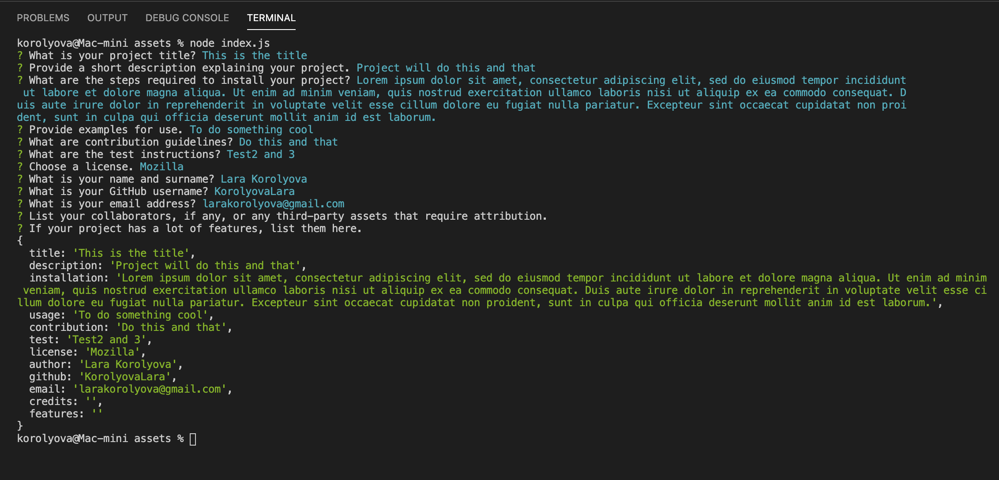
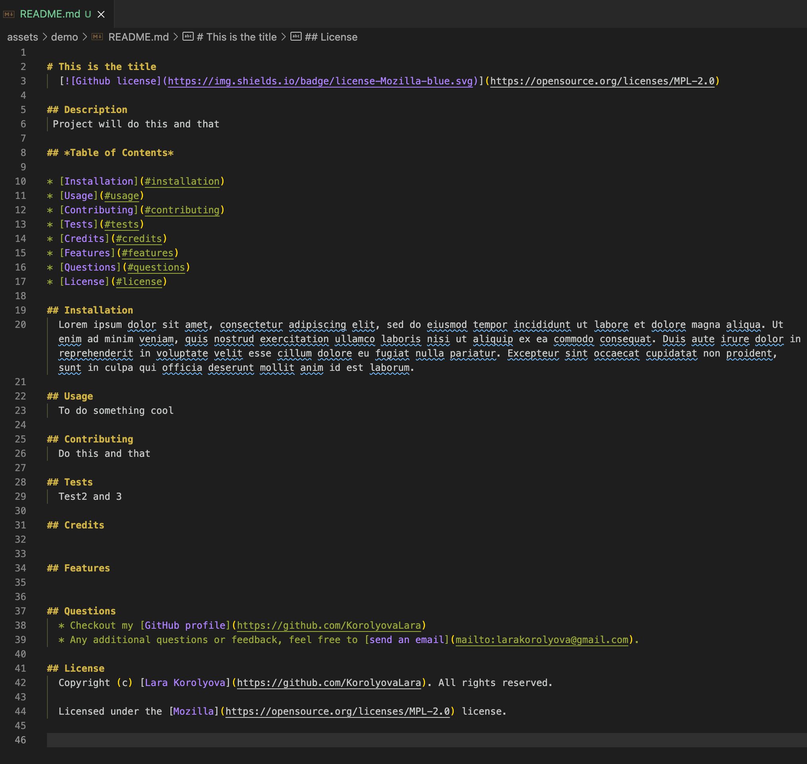
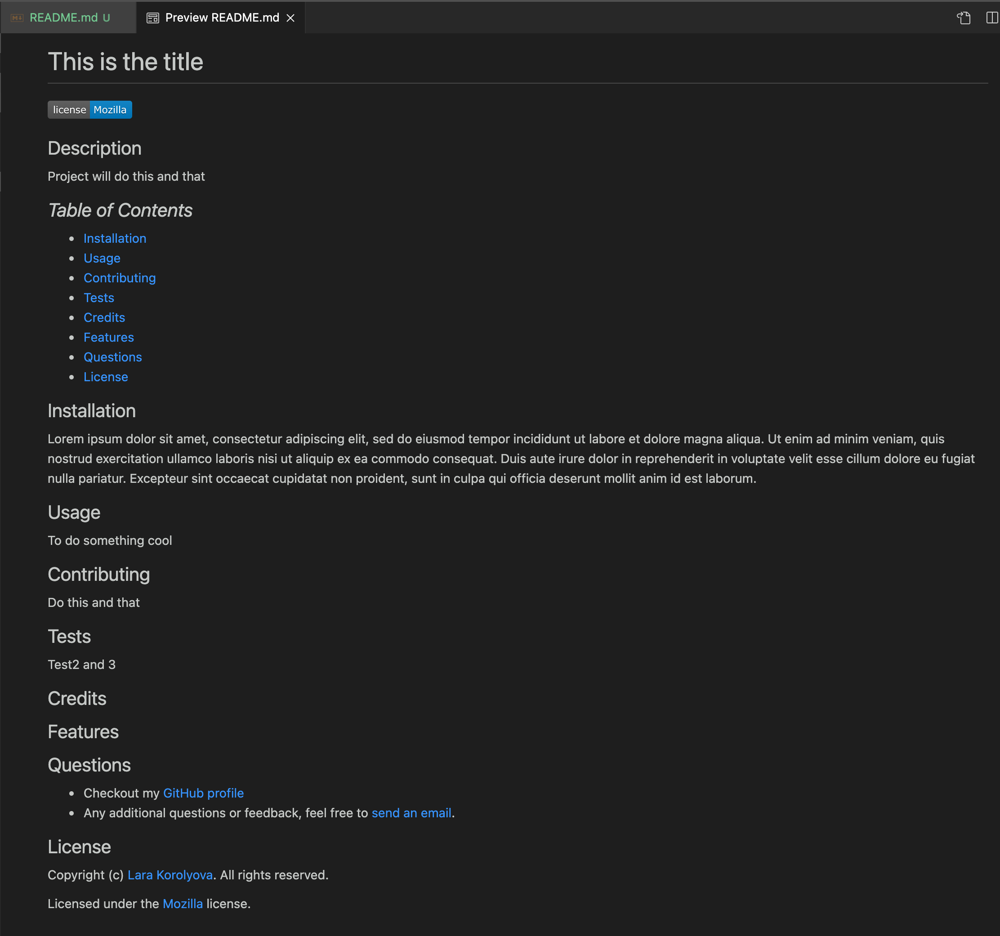

  

  
Table of Contents

  <ol>
    <li><a href="#description">Description</a></li>
    <li><a href="#features">Features</a></li>
    <li><a href="#technical-part">Technical Part</a>
        <ul>
            <li><a href="#demo">Demo</a></li>
            <li><a href="#installation">Installation</a></li>
            <li><a href="#usage">Usage</a></li>
            <li><a href="#contributing">Contributing</a></li>
        </ul>
    </li>
    <li><a href="#questions">Questions</a></li>
    <li><a href="#license">License</a></li>
    <li><a href="#notes">Notes</a></li>
  </ol>

## Description
A command-line application that dynamically generates a professional README.md file from a user's input using the Inquirer package. 

Created to help the developers to devote more time to working on their projects.
## Features
 * JavaScript
 * Node.js
 * npm
## Technical Part
### *Demo*
The following [video](https://drive.google.com/file/d/16OV_WudUSyDUdTIwArKBw5N2e25j-2aP/view?usp=sharing) demonstrates the functionality of the README generator.

The screenshots below show an example of README file generated by this application:

* Terminal Command Lines

* Raw version of README

* Viewer version of README

### *Installation*
1. Download or clone repository
2. [**Node.js**](https://nodejs.org/en/about/) is required to run the application
3. Run `npm install` to install the required npm packages
### *Usage*
* Application is started by using the following command in the terminal:

    `node index.js`

* The user then prompted to answer questions regarding the README file.

* After all questions are answered, the README file generated in a "demo" folder:

        Title of the Project
        Licence Badge
        Description
        Table of Contents, with links to corresponding sections
        Usage
        Contributing
        Tests
        Credits
        Features
        Questions, with link to GitHub profile and email address
        License, with a link to Open Source Initiative for the chosen license 

* The user can change the location for README to be saved by changing the pathway `./demo/` in the code below:

    `return writeToFile ('./demo/README.md', generateMarkdown(data)) `
    
     * or by simply copying the generated README file into user's project folder.
* Enjoy!
### *Contributing*
Pull requests are welcome. For major changes, please open an issue first to discuss what you would like to change, so I learn and understand it better.

Please make sure to update tests as appropriate, if applicable.
## Questions
* Checkout my [GitHub profile](https://github.com/KorolyovaLara)
* Any additional questions or feedback, feel free to [send an email](mailto:larakorolyova@gmail.com).
## License
Copyright (c) [Larysa Korolyova](https://www.linkedin.com/in/korolyova/). All rights reserved.

Licensed under the [MIT](https://github.com/KorolyovaLara/README-Generator/blob/main/LICENSE) license.

---
### Notes
Quote that recently inspired me:
>A man who dares to waste one hour of time has not discovered the value of life.
> -*Charles Darwin*
---
© 2021 L Korolyova
